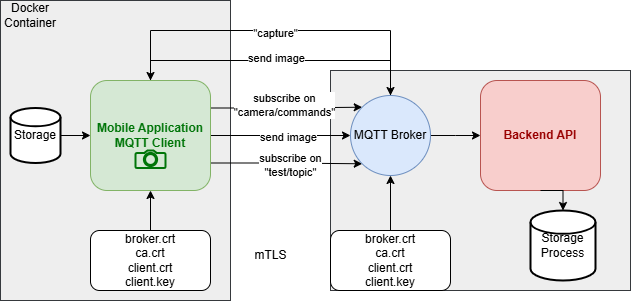

# 📸 MQTTImage: Secure Distributed Image Processing System

A complete end-to-end system for secure, real-time image capture and analysis using Android + MQTT + Flask over mutual TLS (mTLS). This project enables secure camera communication, backend processing (with OCR), and containerized deployment via Docker and CI/CD pipelines.

---

## 🗂 Project Overview

This project addresses the security and privacy concerns of transmitting and processing images from mobile devices. The solution consists of:

- 📱 An Android app for capturing images in various modes
- 🔐 Secure transmission via MQTT over mutual TLS (mTLS)
- 🖥 A Python Flask backend for processing and OCR
- 🐳 Dockerized components with GitHub CI/CD

---

## 🧩 System Architecture

The diagram below illustrates the core components of the architecture:



- Android App captures and transmits images securely using MQTT with client certificates
- Mosquitto Broker handles secure message routing (TLS + certs)
- Flask Backend consumes MQTT messages, saves images, and extracts text via OCR

---

## 🚀 Features

### ✅ Mobile App
- Java Android app with modes:
  - NONE: Send on capture
  - ON DEMAND: Capture when commanded
  - PERIODIC: Capture every 30s
  - LIVE: Stream every 1s
- MQTT over mTLS using embedded certificates (BouncyCastle)
- Offline caching and reconnection handling
- Permission management and network state monitoring

### ✅ Flask Backend
- MQTT subscriber over TLS using paho-mqtt
- Saves images on receipt
- Performs OCR via pytesseract
- Logs extracted text
- Includes Flask web server with health checks

### ✅ Mosquitto Broker
- TLS and mTLS with OpenSSL-generated CA/client/server certificates
- Configurable ports and secure topics

### ✅ CI/CD & Security
- GitHub Actions with Docker build, test, deploy
- SonarQube and Jacoco integration
- Secrets and certs managed via GitHub Secrets
- Bandit & pip-audit used for backend security scanning

---

## 🔐 Mutual TLS Certificate Setup

Certificates were generated using OpenSSL. Below is a simplified command sequence:

```bash
# Generate CA
openssl req -new -x509 -days 365 -keyout ca.key -out ca.crt

# Generate and sign broker cert
openssl genrsa -out broker.key 2048
openssl req -new -key broker.key -out broker.csr
openssl x509 -req -in broker.csr -CA ca.crt -CAkey ca.key -CAcreateserial -out broker.crt -days 200

# Generate and sign client cert
openssl genrsa -out client.key 2048
openssl req -new -key client.key -out client.csr
openssl x509 -req -in client.csr -CA ca.crt -CAkey ca.key -CAcreateserial -out client.crt -days 200
